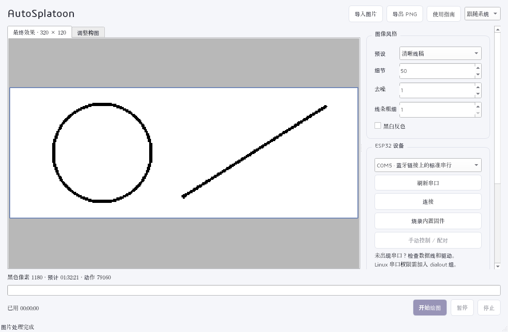
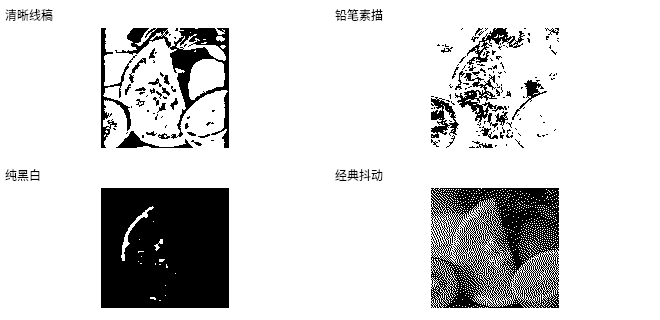

# AutoSplatoon

将图片转换成 Splatoon 的 **320×120 黑白画布**，通过 ESP32 模拟 Pro Controller 自动绘制。保留原项目的串口协议，更新为 Qt 6 界面、OpenCV 图像处理与自包含发行包。

## 下载与首次使用

[下载最新 Release](https://github.com/YaleCheng404/AutoSplatoon/releases/latest) · [构建状态](https://github.com/YaleCheng404/AutoSplatoon/actions/workflows/build.yml) · [1.0.3 更新说明](docs/release-notes/v1.0.3.md)

发行目标：Windows 10/11 x64 ZIP、macOS 14.4+ Apple Silicon DMG、Linux x64 AppImage/目录压缩包。不提供 Intel macOS。包内包含 Qt 运行库、图片格式插件、esptool 5.4.0 与 UARTSwitchCon 1.2 固件；无需安装 Python 或开发环境。

1. 用可传输数据的 USB 线连接传统 ESP32，选择串口。
2. 点击“烧录内置固件”。程序先确认芯片，再写入内置 PRO-UART0.bin（地址 0x0）；烧录会覆盖已有固件。失败时检查 USB 线并按住 BOOT 重试。
3. 点击“连接”，进入“手动控制 / 配对”，在 Switch“更改握法 / 顺序”中按 L + R 配对；显示“Switch 手柄通信正常”后可自动绘图。参考 [上游硬件与配对说明](https://github.com/nullstalgia/UARTSwitchCon)。
4. 打开游戏绘图画布，用手动控制校准到指定起点。坐标从 0 开始；默认左上角 (0,0)。
5. 导入图片，在“调整构图”标签拖动、滚轮缩放，选择预设，检查结果后开始绘图。按下/释放默认各 70 ms；可暂停、继续或停止，结束可自动保存。

没有开发板也能处理图片和导出 PNG。预览、导出和动作计划使用同一黑白结果，缩放窗口与显示器 DPI 不改变画布像素。界面优先使用系统字体，缺少中文字形时使用内置 Noto Sans CJK 回退；使用自适应布局与滚动参数栏，提供浅色、深色及系统主题。

## 图片处理

| 预设 | 用途 |
|---|---|
| 清晰线稿（默认） | 保边去噪、自适应阈值、小区域清理，保留连续轮廓 |
| 铅笔素描 | OpenCV pencilSketch 后转换为黑白，适合照片轮廓 |
| 纯黑白 | 可调阈值，适合文字和已有线稿 |
| 经典抖动 | Qt 黑白误差扩散，表达照片明暗 |

可调整细节、去噪、线条粗细、阈值及反色；只显示当前预设使用的参数。默认等比居中，透明区域叠到白底。处理在后台执行，快速调参只展示最新结果。“手绘感”指最终图像效果，绘制动作采用可验证的蛇形扫描。

对比素材来自 [OpenCV 4.14.0 fruits.jpg](https://github.com/opencv/opencv/blob/4.14.0/samples/data/fruits.jpg)，方形照片等比居中到 320×120 画布，左右留白；图中输出未做额外美化。

## 串口与硬件

协议为 19200 波特率、CRC-8 和上游握手。固件 SHA-256：`d8b2e49b221bb363ef1d72908582ce48690e3b9538500aeb77f470b433b66039`，来源和许可证见 [firmware/README.md](firmware/README.md)。支持范围限传统 ESP32；其他 ESP32 系列和 Switch 2 未验证。

Windows/macOS 找不到串口时，先在设备管理器/系统信息确认 USB 转串口芯片，按板卡型号安装 [Silicon Labs CP210x 驱动](https://www.silabs.com/developer-tools/usb-to-uart-bridge-vcp-drivers) 或 [WCH CH34x 驱动](https://www.wch.cn/downloads/CH341SER_EXE.html)，不要盲目安装全部驱动。Linux 检查 `/dev/ttyUSB*`、`/dev/ttyACM*` 和 `ls -l` 的所属组；Debian/Ubuntu 通常执行 `sudo usermod -aG dialout "$USER"` 后注销并重新登录。不建议以 root 运行应用。AppImage 无 FUSE 时可用 `APPIMAGE_EXTRACT_AND_RUN=1 ./AutoSplatoon-*.AppImage`，或使用目录包中的 AppRun。

## 开发与验证

[硬件与故障排查](docs/hardware.md) · [构建与发布说明](docs/building.md) · [验收与验证边界](docs/validation.md) · [本次验证记录](docs/validation-results.md) · [第三方与参考来源](licenses/THIRD_PARTY.md)。依赖固定于 `dependencies.lock.json`。项目使用 C++17、CMake/CTest/CPack，移除 qmake、未使用的网络库及旧实验界面。

参考 [jiangotto 原项目](https://github.com/jiangotto/AutoSplatoon)、[zhougz520 的动作队列和串口修复](https://github.com/zhougz520/AutoSplatoon/tree/1309d77af0210cd951d49d7aaf4e2b1e2baf7d1c)、[Exception0x0194](https://github.com/Exception0x0194/AutoSplatoon)、[splatplost](https://github.com/Victrid/splatplost) 和 [img2splat](https://github.com/JonathanNye/img2splat)。借用范围与许可证在第三方声明中记录。

项目及固件沿用 GPL-3.0，见 LICENSE。用户已反馈 1.0.2 测试无问题；具体型号与逐项硬件覆盖未提供，详见验证记录。构建/模拟测试与用户实机反馈分别记录。

### 1.0.3 Linux 发行修复

补齐 offscreen、Wayland 平台及集成插件，部署检查清除 SDK 搜索路径，并在精简 Ubuntu / Debian 容器验证发行包。v1.0.2 的容器检查阻止了发布，1.0.3 为首个完整多平台 Release；固件不变。

### 1.0.2 画布边框

“最终效果”和“调整构图”均显示固定比例的蓝色画布边框，画布外使用灰色背景。拖动或放大图片时超出画布的部分隐藏，便于确认裁切范围。边框只用于预览，不影响导出、绘图像素或构图结果。

### 1.0.1 串口修复

串口握手成功后可以直接进入手动控制，在 Switch 的“更改握法 / 顺序”页面按 L + R 配对。配对之前不会因为没有手柄报告而断开串口；收到蓝牙手柄报告后启用自动绘图。报告中断超过 5 秒时停止绘图，保留串口和手动控制供重新配对。内置固件没有改变，升级软件不需要重新烧录。

UARTSwitchCon 1.2 的 `0x90` 来自定时发送蓝牙 HID 报告的 `send_buttons()`，不是每个串口输入包的确认，见 [对应版本源码](https://github.com/nullstalgia/UARTSwitchCon/blob/1.2/ESP32/source/firmware/main/main.c)。1.0.0 的逐包超时判断已移除，并修复已配对设备持续发送报告时阻塞握手的问题。
